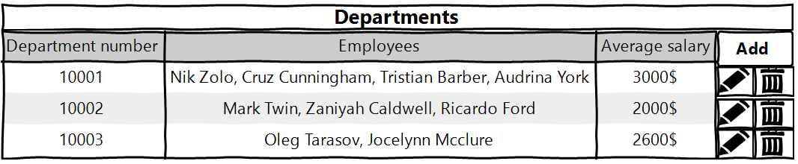
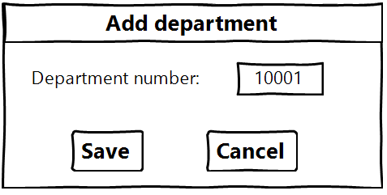
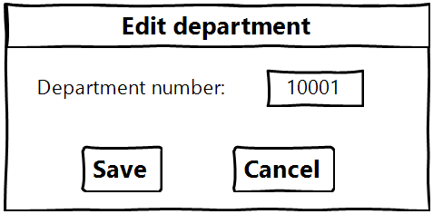
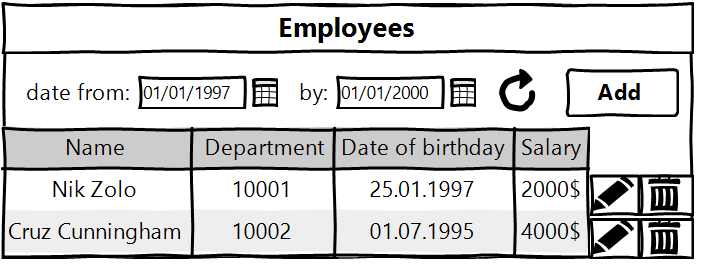
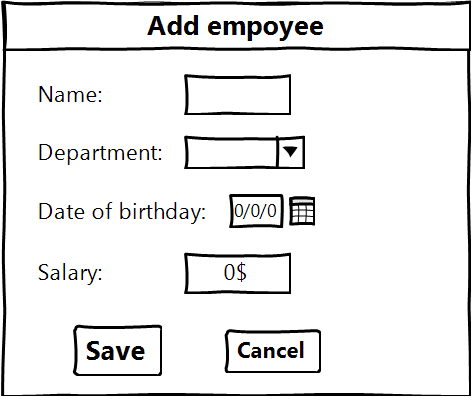
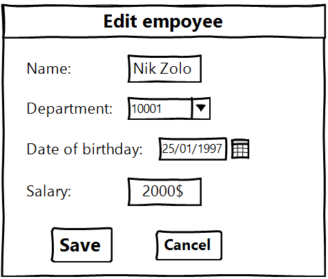

### Departments handler
#### Vision
"Departments handler" is web-application which allows users to record information about departments and employees.
Application should provide:
- Storing departments and employees in a database;
- Display a list of departments and the average salary for these departments;
- Updating the list of departments(adding, editing, removing);
- Display a list of employees;
- Updating the list of employees(adding, editing, removing);
- Searching employees by born date.
#### 1. Departments
##### 1.1 Display list of departments
The page is designed to view the list of departments.
##### Main scenario:
- User selects item "Departments";
- Application displays list of departments.

##### The list displays following columns:
- Department number - unique department number;
- Employees - list of employees which work in department;
- Average salary - average salary of department that is calculated automatically.
##### 1.2 Add department
##### Main scenario:
- User clicks the "Add" button on the departments page;
- Application opens page to enter new department;
- User enters data and presses "Save" button;
- If any data is entered incorrectly, incorrect data messages are displayed;
- If entered data is valid, then record is added to database;
- If error occurs, then error message is displayed;
- If new department is successfully added, then list of departments updates and departments page is displayed.
##### Cancel scenario:
- User clicks the "Add" button on the departments page;
- Application opens page to enter new department;
- User enters data and presses "Cancel" button;
- Data isn\`t saved in data base, then list of departments is displayed;

When adding a department, the following details are entered:
- Department number.
Constraints for data validation:
- Department number - unique id (5 digits).
##### 1.3 Edit department
##### Main scenario:
- User clicks "Edit button" on the department page;
- Application opens page to enter department data;
- User enters data and presses "Save" button;
- If any data is entered incorrectly, incorrect data messages are displayed;
- If entered data is valid, then record is added to database;
- If error occurs, then error message is displayed;
- If department\`s record is successfully edited, then list of departments updates and departments page is displayed.
##### Cancel scenario:
- User clicks the "Edit" button on the departments page;
- Application opens page to enter department data;
- User enters data and presses "Cancel" button;
- Data isn\`t saved in data base, then list of departments is displayed.

When editing a department, the following details are entered:
- Department number.
Constraints for data validation:
- Department number - unique id (5 digits).
##### 1.4 Removing the department
##### Main scenario:
- User clicks the "Delete" button on the departments page;
- A confirmation dialog is displayed;
- User confirms the removal of the department;
- Record is deleted from database;
- All employees who work in this department are deleted from database;
- If department is successfully deleted, then list of departments without deleted record is displayed.
##### Cancel scenario:
- User clicks the "Delete" button on the departments page;
- Application displays confirmation dialog;
- User presses "Cancel" button;
- List of departments without changes is displayed.
[========]
#### 2. Employees
##### 2.1 Display list of employees
This page is intended for viewing and editing the employees list.
##### Main scenario:
- User selects item "Departments";
- Application displays list of employees.

The list displays the following columns:
- Name - employee\`s full name;
- Department - employee\`s department number;
- Date of birthday - employee\`s date of birthday;
- Salary - employee\`s salary.
##### Filtering by date:
- On the employees page, the user sets a date filter and presses the refresh list button (to the
right of the date entry field);
- The application shows the employees only for a certain period of time.
Restrictions:
- Start date of the period should be less than end date of the period;
- If start date is blank, then filtering by end date only.
- If end date is blank, then filtering by start date only.
- Updating data after selecting the filtering conditions is carried out by pressing the “Refresh” button.
##### 2.2 Add employee
##### Main scenario:
- User clicks the "Add" button on the employees page;
- Application opens page to enter new employee;
- User enters data and presses "Save" button;
- If any data is entered incorrectly, incorrect data messages are displayed;
- If entered data is valid, then record is added to database;
- If error occurs, then error message is displayed;
- If new employee is successfully added, then list of employees updates and employees page is displayed.
##### Cancel scenario:
- User clicks the "Add" button on the departments page;
- Application opens page to enter new employee;
- User enters data and presses "Cancel" button;
- Data isn\`t saved in data base, then list of employees is displayed;

When adding an employee, the following details are entered:
- Name - employee\`s full name;
- Department - employee\`s department number;
- Date of birthday - employee\`s date of birthday;
- Salary - employee\`s salary.
Constraints for data validation:
- Name - maximum length of 45 characters;
- Department - existing department number (5 digits);
- Date of birthday -  employee\`s date of birthday in format dd/mm/yyyy.
- Salary - maximum length of numbers is 6;
##### 2.3 Edit employee
##### Main scenario:
- User clicks "Edit button" on the employees page;
- Application opens page to enter employee data;
- User enters data and presses "Save" button;
- If any data is entered incorrectly, incorrect data messages are displayed;
- If entered data is valid, then record is added to database;
- If error occurs, then error message is displayed;
- If employee\`s record is successfully edited, then list of employees updates and employees page is displayed.
##### Cancel scenario:
- User clicks the "Edit" button on the employees page;
- Application opens page to enter department data;
- User enters data and presses "Cancel" button;
- Data isn\`t saved in data base, then list of employees is displayed.

When editing an employee, the following details are entered:
- Name - employee\`s full name;
- Department - employee\`s department number;
- Date of birthday - employee\`s date of birthday;
- Salary - employee\`s salary.
Constraints for data validation:
- Name - maximum length of 45 characters;
- Department - existing department number (5 digits);
- Date of birthday -  employee\`s date of birthday in format dd/mm/yyyy.
- Salary - maximum length of numbers is 6;
##### 2.4 Removing the employee
##### Main scenario:
- User clicks the "Delete" button on the employees page;
- A confirmation dialog is displayed;
- User confirms the removal of the employee;
- Record is deleted from database;
- If employee is successfully deleted, then list of employees without deleted record is displayed.
##### Cancel scenario:
- User clicks the "Delete" button on the employees page;
- Application displays confirmation dialog;
- User presses "Cancel" button;
- List of employees without changes is displayed.
